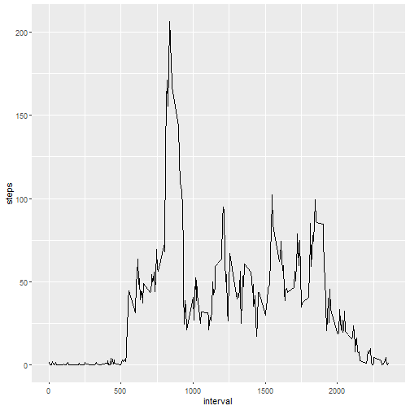
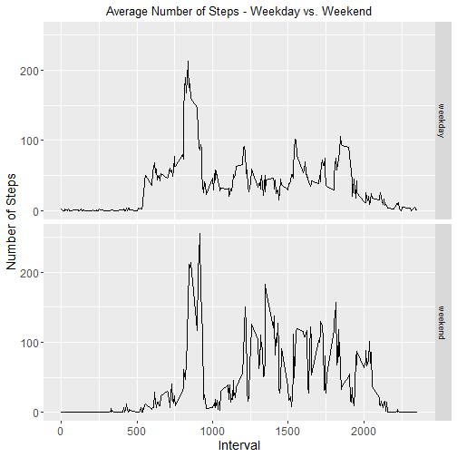

---
---
title: "Reproducible Research: Peer Assessment 1"
author: "Ahmed Mohamed"
date: "16‏/10‏/2020"
output: 
  html_document:
    keep_md: true
---


## Loading and preprocessing the data

```r
download.file("https://d396qusza40orc.cloudfront.net/repdata%2Fdata%2Factivity.zip", destfile = "activity.zip", mode="wb")
# unzip data and read 
unzip("activity.zip")
stepdata <- read.csv("activity.csv", header = TRUE)
head(stepdata)
```

```
##   steps       date interval
## 1    NA 2012-10-01        0
## 2    NA 2012-10-01        5
## 3    NA 2012-10-01       10
## 4    NA 2012-10-01       15
## 5    NA 2012-10-01       20
## 6    NA 2012-10-01       25
```
## attaching packages

```r
require(dplyr)
library(ggplot2)
```

## What is mean total number of steps taken per day?

```r
stepByDate<-stepdata%>%select(date,steps)%>%group_by(date)%>%summarize(steps=sum(steps))%>%na.omit()
```

```
## `summarise()` ungrouping output (override with `.groups` argument)
```

```r
hist(stepByDate$steps, xlab = "Total daily Steps",main="Histogram of Total Steps by day",breaks = 20)
```


```r
mean(stepByDate$steps)
```

```
## [1] 10766.19
```

```r
median(stepByDate$steps)
```

```
## [1] 10765
```


## What is the average daily activity pattern?

```r
dataByInterval<- stepdata%>%select(interval,steps)%>%na.omit()%>%group_by(interval)%>%summarize(steps=mean(steps))
```

```
## `summarise()` ungrouping output (override with `.groups` argument)
```

```r
ggplot(dataByInterval, aes(x=interval, y=steps))+ geom_line()
```



```r
dataByInterval[which(dataByInterval$steps== max(dataByInterval$steps)),]
```

```
## # A tibble: 1 x 2
##   interval steps
##      <int> <dbl>
## 1      835  206.
```


## Imputing missing values

```r
missingValue<-sum(is.na(stepdata))
missingValue
```

```
## [1] 2304
```

```r
meanData<-stepdata%>%group_by(interval)%>%mutate(steps=replace(steps,is.na(steps),mean(steps,na.rm = T)))
head(meanData)
```

```
## # A tibble: 6 x 3
## # Groups:   interval [6]
##    steps date       interval
##    <dbl> <chr>         <int>
## 1 1.72   2012-10-01        0
## 2 0.340  2012-10-01        5
## 3 0.132  2012-10-01       10
## 4 0.151  2012-10-01       15
## 5 0.0755 2012-10-01       20
## 6 2.09   2012-10-01       25
```

```r
FullSummedDataByDay<-with(meanData,aggregate(steps,by=list(date),sum))
names(FullSummedDataByDay)[1] ="date"
names(FullSummedDataByDay)[2] ="totalsteps"
head(FullSummedDataByDay)
```

```
##         date totalsteps
## 1 2012-10-01   10766.19
## 2 2012-10-02     126.00
## 3 2012-10-03   11352.00
## 4 2012-10-04   12116.00
## 5 2012-10-05   13294.00
## 6 2012-10-06   15420.00
```

```r
summary(FullSummedDataByDay)
```

```
##      date             totalsteps   
##  Length:61          Min.   :   41  
##  Class :character   1st Qu.: 9819  
##  Mode  :character   Median :10766  
##                     Mean   :10766  
##                     3rd Qu.:12811  
##                     Max.   :21194
```

```r
hist(FullSummedDataByDay$totalsteps, xlab = "Steps", ylab = "Frequency", main = "Total Daily Steps", breaks = 20)
```


```r
oldmean <- mean(stepByDate$steps, na.rm = TRUE)
newmean <- mean(FullSummedDataByDay$totalsteps)
oldmean
```

```
## [1] 10766.19
```

```r
newmean
```

```
## [1] 10766.19
```

```r
oldmedian <- median(stepByDate$steps, na.rm = TRUE)
newmedian <- median(FullSummedDataByDay$totalsteps)
oldmedian
```

```
## [1] 10765
```

```r
newmedian
```

```
## [1] 10766.19
```


## Are there differences in activity patterns between weekdays and weekends?

```r
activityDoW <- meanData
activityDoW$date <- as.Date(activityDoW$date)
activityDoW$day <- ifelse(weekdays(activityDoW$date) %in% c("السبت", "الحد"), "weekend", "weekday")
activityDoW$day <- as.factor(activityDoW$day)
activityWeekday <- activityDoW%>% filter(day == "weekday")
activityWeekend <- activityDoW%>%filter(day == "weekend")

activityWeekday <- activityWeekday %>%
        group_by(interval) %>%
        summarize(steps = mean(steps)) 
```

```
## `summarise()` ungrouping output (override with `.groups` argument)
```

```r
activityWeekday$day <- "weekday"

activityWeekend <- activityWeekend %>%
        group_by(interval) %>%
        summarize(steps = mean(steps)) 
```

```
## `summarise()` ungrouping output (override with `.groups` argument)
```

```r
activityWeekend$day <- "weekend"

wkdayWkend <- rbind(activityWeekday, activityWeekend)
wkdayWkend$day <- as.factor(wkdayWkend$day)


g <- ggplot (wkdayWkend, aes (interval, steps))
g + geom_line() + facet_grid (day~.) + 
        theme(axis.text = element_text(size = 12),axis.title = element_text(size = 14)) + 
        labs(y = "Number of Steps") + labs(x = "Interval") + 
        ggtitle("Average Number of Steps - Weekday vs. Weekend") + 
        theme(plot.title = element_text(hjust = 0.5))
```


